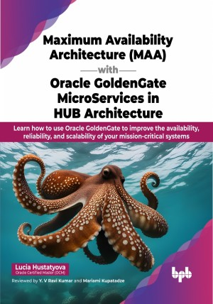

# Maximum Availability Architecture (MAA) with Oracle GoldenGate MicroServices in HUB Architecture

A step-by-step guide for designing, implementing, and managing Oracle GoldenGate with HUB Architecture

This is the repository for [Maximum Availability Architecture (MAA) with Oracle GoldenGate MicroServices in HUB Architecture
](https://bpbonline.com/products/maximum-availability-architecture-maa-with-oracle-goldengate-microservices-in-hub-architecture),published by BPB Publications.

## About the Book
Oracle GoldenGate is a software product that allows you to replicate data from one database to another. If you are interested in using Oracle GoldenGate Microservices (OGG MA) in HUB configuration for database upgrade, migration, and data replication, then this book is a valuable resource for you.

This book provides a step-by-step guide for designing and implementing an Oracle GoldenGate Microservices architecture in a hub configuration, with high availability (HA) and disaster recovery (DR) capabilities. It begins by explaining the architecture of Oracle GoldenGate Microservices, and then provides real-world examples of how it can be used to upgrade or migrate databases, replicate data, and monitor the environment. Moving on, the book includes detailed instructions on how to install and configure Oracle GoldenGate Microservices, as well as, how to use the REST API, command line, and web interface to manage the solution. Lastly, the book provides a practical example of how the architecture can be used to achieve HA and DR for data replication.

By the end of the book, you will be a confident and knowledgeable OGG MA user, who is able to design, implement, and manage Oracle GoldenGate Microservices Architecture solutions for your organization.

## What You Will Learn
•  Understand the architectural design of OGG MA in HUB configuration using ACFS.

•  Set up monitoring for OGG MA with Oracle Cloud Control.

•  Use the REST API in OGG for automation.

•  Check and verify data consistency with Veridata.

•  Perform patching without extended downtime by using high-availability capabilities.

•  Learn how to handle errors during data replication in ACFS or OGG extract/replicat processes.
